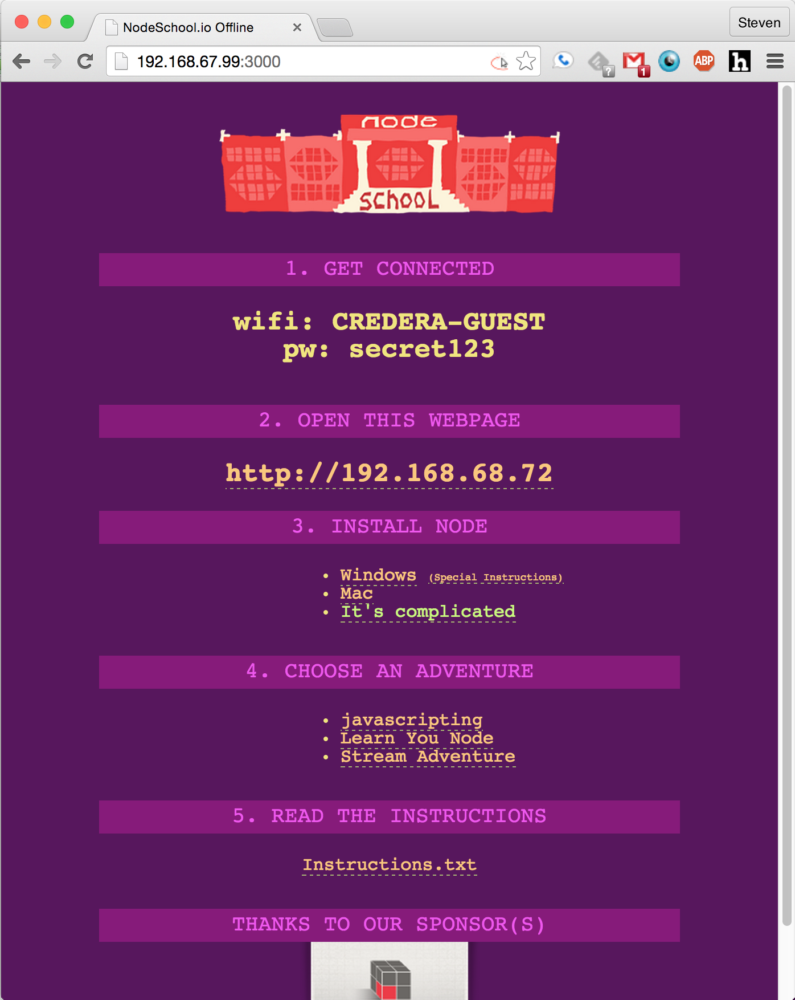

nodeschool-offline
==================

Offline site for NodeSchool.io events that includes Node installers, zipped workshoppers and instructions.  Host your instructions and downloads from a laptop to avoid bottleneck shared internet connection.

This page is to be run by one of the presenters on their laptop and projected during the meetup (or at least the beginning) and serves two purposes:

1. Informational screen so users walking into the meetup know what to do
2. Once users connect (using the page's instructions) they navigate to it on their laptops to get started installing Node.JS and/or workshops.

Fork for [Nodeschool Dallas](https://github.com/nodeschool/dallas) meetups.

## Setup

First time you want to run you need to download all the dependencies.  Will have to do this again whenever you add a module.
```
> npm install
```

## Running

The default gulp task opens a web server at port 3000
```
> gulp
```
Then visit http://localhost:3000
Find your local ip address with 'ifconfig' (mac) or 'ipconfig' (windows) and attendees can go to http://<your-ip>:3000 and get started.
